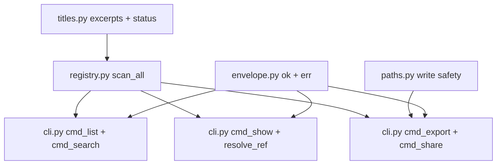

# Listing CLI Export Knowledge Base

## §0 Contents

| § | Title | When |
|---|------|------|
| §1 | Business background and core concepts | First contact with this domain |
| §1.5 | Architecture overview | Quick layered mental model (mermaid) |
| §2 | Core business flows / state machines | Main flows and status enums |
| §2.5 | Physical path cheat sheet | Locate code dirs directly (glob/ls) |
| §3 | Code entry index | Find entries by task scenario |
| §4 | Table and field entry index | When changing tables/fields/queries |
| §5 | Flow / component / job / MQ entry index | When changing orchestration / cron / messaging |
| §6 | Core business rules and hidden constraints | AI pitfalls to scan before changing code |
| §7 | Validation paths | How to verify correctness after changes |
| §8 | Related docs | Cross-domain reading guides |
| §9 | Coverage and to-be-filled items | Doc confidence and gaps |

## §1 Business background and core concepts

This domain is the user-facing surface of SessKit: session discovery output
(`list`, `search`), single-session reads (`show`), bulk and share exports
(`export`, `share`), and command introspection (`describe`). Every command
prints one JSON envelope (`ok`, `data`, `error`, `meta`) so shells, scripts,
and other languages consume SessKit without importing Python. Exit codes stay
stable: 0 ok, 1 error, 2 usage, 3 not found, 5 ambiguous.

Canonical terms: envelope (the single printed JSON object), session payload
(one scanned session record with excerpt and status fields), list (bounded
resume-oriented scan), search (keyword match over titles and snippets),
show (full plain conversation for one session), export (time-bounded bulk
plain conversations), share (rich transcript events plus metadata for
portability), describe (command help as data). Implementation aliases (function
and file names) appear verbatim only in entry indexes.

Listing defaults to resume-oriented behavior: sessions whose project directory
no longer exists are dropped, and automation-owned workspaces never list. Read
paths never modify history; write paths use same-directory temp files plus
atomic replace and refuse to overwrite protected history paths.

## §1.5 Architecture overview

## §2 Core business flows / state machines

### Envelope and exit contract

Success prints `{"ok": true, "data": {...}, "error": null, "meta":
{"version": 1}}`. Failure prints `ok: false` with `data: null` and an `error`
object carrying `code`, `message`, `hint`, and `next_commands`. The process
exit code mirrors the outcome so scripts can branch without parsing JSON.

### List flow

`cmd_list()` fans out through `ParserRegistry.scan_all()`, merges per-runtime
session lists, applies the missing-directory and ephemeral filters, sorts by
recency, and trims to the requested top N. The `--compact` flag selects the
dense print form. Field selection (`--fields`) projects each session payload
without changing scan semantics.

### Search flow

`cmd_search()` reuses the scan map, scores title plus snippet matches per
session, and returns ranked hits with match positions. Scoring prefers prompt
and digest text over boilerplate; handoff-wrapped sessions match on the
extracted task rather than the wrapper.

### Show flow

`cmd_show()` resolves one session reference (full id, id prefix, or short id)
via `resolve_ref()`, reports not-found versus ambiguous explicitly, loads the
plain conversation through the session-dict adapter, and prints the message
list with `--full` controlling truncation. Missing history surfaces as an
error envelope, never an empty success.

### Export flow

`cmd_export()` resolves a time-bounded session set (`--since`, `--until`),
loads each plain conversation, and writes one bulk JSON document. Per-session
load failures are recorded without silently inventing empty transcripts for
missing histories.

### Share flow

`cmd_share()` builds a portable payload (`build_share_payload()`) with session
metadata plus rich transcript events, then writes it through
`write_share_envelope()` with atomic temp-plus-replace safety. Cache helpers
(`share_cache_path()`, `export_share_to_cache()`) stage repeatable share
documents under the product cache directory.

### Describe flow

`cmd_describe()` prints command specs as data so tooling can discover flags
without scraping help text. Unknown command names produce usage errors
pointing at the describe command itself.

## §2.5 Physical path cheat sheet

| Directory (relative to project root) | Contents | Key classes / file count |
|------|------|--------|
| `src/sesskit/cli.py` | All six command implementations plus dispatch | `cmd_list()`, `cmd_search()`, `cmd_show()`, `cmd_export()`, `cmd_share()`, `cmd_describe()`, `resolve_ref()`, `build_parser()`, `dispatch()`, `main()` |
| `src/sesskit/envelope.py` | Envelope constructors and exit codes | `ok()`, `err()`, `print_envelope()`, `ApiError`, `API_VERSION`, `EXIT_OK`, `EXIT_ERROR`, `EXIT_USAGE`, `EXIT_NOT_FOUND`, `EXIT_AMBIGUOUS` |
| `src/sesskit/registry.py` | Scan fan-out backing list and search | `ParserRegistry.scan_all()`, `default_registry()` |
| `src/sesskit/titles.py` | Excerpt clipping and title helpers used by list payloads | Excerpt limit, `_title_line()`, handoff-digest helpers, completion-id helpers |
| `src/sesskit/paths.py` | Write-safety helpers for export and share | `assert_not_history_path()`, `atomic_write_json()`, `realpath_or_abs()` |
| `src/sesskit/cache.py` | File signatures and no-op cache defaults | `file_signature()`, `NullSessionCache`, `get_cache()`, `set_cache()` |

## §3 This domain's code entry index

| Scenario | Entry | Class/method/config | Notes |
|---|---|---|---|
| List recent sessions | `src/sesskit/cli.py` | `cmd_list()` | Scan map plus merge, sort, top-N trim, field projection |
| Search by keywords | `src/sesskit/cli.py` | `cmd_search()` | `_score_quick_match()` plus `_find_snippet()` over titles and excerpts |
| Show one conversation | `src/sesskit/cli.py` | `cmd_show()` | `resolve_ref()` then `_load_messages()` through the session-dict adapter |
| Resolve id or prefix | `src/sesskit/cli.py` | `resolve_ref()`, `_match_sessions()` | Not-found versus ambiguous reported distinctly with next-command hints |
| Bulk export by time | `src/sesskit/cli.py` | `cmd_export()`, `_parse_time_bound()` | Time-bound parsing plus per-session plain loads |
| Build and write share payload | `src/sesskit/cli.py` | `build_share_payload()`, `write_share_envelope()`, `cmd_share()` | Rich events plus metadata; atomic write with protected-path checks |
| Stage share in cache | `src/sesskit/cli.py` | `share_cache_path()`, `export_share_to_cache()` | Repeatable cache location under the product cache dir |
| Print command help as data | `src/sesskit/cli.py` | `cmd_describe()`, `_describe_command()` | Unknown names route back to describe hints |
| Dispatch argv | `src/sesskit/cli.py` | `build_parser()`, `dispatch()`, `main()` | JSON argument parser plus subcommand routing |
| Build success or error envelopes | `src/sesskit/envelope.py` | `ok()`, `err()`, `print_envelope()` | Single envelope shape with version meta |
| Trim and resolve titles | `src/sesskit/cli.py` | `_trim()`, `_resolve_title()`, `_apply_fields()`, `_apply_top()` | Bounded display helpers shared by list and search |
| Guard output paths | `src/sesskit/paths.py` | `assert_not_history_path()`, `atomic_write_json()` | Realpath comparison against protected history paths; temp-plus-replace writes |
| Sign file changes | `src/sesskit/cache.py` | `file_signature()` | Device plus inode plus size plus mtime-ns for cache keys |

## §4 This domain's table and field entry index

There is no relational database. This section indexes the list-payload and
envelope fields that callers filter, clip, or match on.

| Table/field | Entity/Mapper | Business meaning | Change notes |
|---|---|---|---|
| Envelope `ok` / `data` / `error` / `meta` | `src/sesskit/envelope.py` envelope | Single output contract for every command | Never print bare payloads; always wrap success and failure the same way |
| Envelope `error.code` / `message` / `hint` / `next_commands` | `src/sesskit/envelope.py` error object | Machine code plus human guidance plus follow-ups | Keep hints actionable with exact next commands |
| `session_payload()` projection | `src/sesskit/cli.py` session shaping | Field-selected session view | Projection never changes scan or filter semantics |
| `first_user_msg` / `last_user_msg` / `last_agent_msg` | `src/sesskit/titles.py` excerpt pipeline | Bounded 300-character previews | Handoff digests extracted before clipping; error text may fill agent excerpts on abnormal ends |
| `native_title` / `fallback_title` | Parser session builders plus title helpers | Authoritative versus derived titles | Native preferred; fallback derives from first meaningful user text |
| `status_tag` | `src/sesskit/titles.py` status mapping | History-tail outcome for lists | Bounded-window inference only; excerpt backfill must not widen it |
| `completion_id` | Completion helpers in scanners and titles | Stable terminal-round marker | Empty unless terminal; used for completion dedup by consumers |
| `live` / `pid` | Scanner liveness marking | Process-holding signal | Independent from history outcome; never merged into one flag |
| `include_missing_cwd` | Scanner flag plus `_include_missing_cwd()` | Archive versus resume listing mode | Default drops missing directories; archive flows opt in explicitly |
| Time bounds `--since` / `--until` | `src/sesskit/cli.py` export parsing | Bulk export window | Parse failures produce usage errors, not silent full exports |

## §5 This domain's flow / component / job / MQ entry index

No queues, crons, or flow engines exist. This section indexes the read and
write pipelines behind the commands.

| Type | Id | Code entry | When used |
|---|---|---|---|
| Read | Scan map | `src/sesskit/cli.py` `_scan_map()` | Shared scan behind list, search, show resolution, and export selection |
| Read | Reference resolution | `src/sesskit/cli.py` `resolve_ref()` | Every single-session command; ambiguity lists candidates with follow-up commands |
| Read | Message load | `src/sesskit/cli.py` `_load_messages()` | Show, export, and share reads; missing history raises into an error envelope |
| Write | Atomic JSON write | `src/sesskit/paths.py` `atomic_write_json()` | Export and share outputs; same-directory temp file plus `os.replace` plus fsync |
| Write | History-overwrite guard | `src/sesskit/paths.py` `assert_not_history_path()` | Every export and share write; compares realpaths including symlinks |
| Write | Share cache staging | `src/sesskit/cli.py` `export_share_to_cache()` | Repeatable share documents without touching history paths |
| Validation | Smoke commands | `tests/test_cli_smoke.py` | Envelope, exit-code, and help coverage for the command surface |

## §6 Core business rules and hidden constraints

- **AI pitfall** 【Forbidden】Turn `include_missing_cwd` on for resume-style listings -> must keep the default drop for interactive recovery paths and enable the flag only for archive and search flows where history files still exist (reason: deleted project directories would otherwise flood resume views with unrestorable sessions).
- **AI pitfall** 【Forbidden】Assume the archive flag bypasses ephemeral filtering -> must keep ephemeral workspaces unlisted regardless of the flag; manager-job and marker-ignored sessions never list, with only the process-local opt-in flag observing them in the owning process.
- **AI pitfall** 【Hidden dependency】Before writing any export or share file, collect the protected history paths and call the history-path guard; symlinked outputs that resolve onto history must also refuse, else a bulk export can clobber the history it just read.
- **AI pitfall** 【Hidden dependency】Before truncating destination files in place, use the temp-plus-replace writer for export/share snapshot files (publication semantics: [Python spec](~/Codes/_standards/python.md#publishing-complete-snapshots)); the protected-history guard binding above still applies. The writer is §5 `atomic_write_json` (same-directory temp + os.replace); verification is in §7. Append/in-place protocols follow their own contracts.
- 【Forbidden】Return a successful empty conversation for missing history on show, export, or share -> must surface the load error through the envelope with refresh guidance; empty means a readable history with zero normalized events.
- 【Hidden dependency】Before resolving short ids or prefixes, handle the three-way outcome (unique match, not found, ambiguous) with distinct codes and follow-up commands; collapsing ambiguous into not-found strands scripts that guessed a prefix.
- 【Hidden dependency】Before clipping excerpts for list payloads, run the handoff-digest extraction; raw slicing fills the bounded window with wrapper boilerplate and hides the real task from search scoring and title generation.
- 【Disambiguation】Resume listing versus archive search: resume drops missing directories for restorability; archive includes them for completeness. The flag selects the mode; ephemeral filtering applies in both.
- 【Disambiguation】Plain show versus rich share: show returns chat-readable user and assistant turns; share returns rich transcript events plus metadata for portability. They are not interchangeable inputs to the same consumer.
- 【Naming alignment】Command verbs (`list`, `search`, `show`, `export`, `share`, `describe`) are the canonical surface; internal function names (`cmd_list`, `resolve_ref`, `session_payload`) appear only in entry indexes.
- 【Low confidence】Search ranking weights are heuristic (title plus snippet scoring without a relevance model); new wrapper styles may need scoring retunes after live sampling (evidence: `src/sesskit/cli.py` scoring helpers; pending: ranked-query evaluation).
- - 【Ruling】[2026-09-29] User confirmed SessKit stays a standalone surface with no downstream-host coupling: command behavior, envelope text, hints, and follow-up commands must not name downstream products, host paths, or host-owned flows. Prior hints and docs referenced a specific downstream surface by name; that coupling is the removal target. Future CLI work must keep host integration outside this repo unless the user explicitly reverses this decision.

## §7 Common easy-to-miss conditions and validation paths

- After changing any command: run `python3 -m pytest tests/test_cli_smoke.py -q` and confirm envelope shapes plus exit codes hold.
- After changing list or search: run `sesskit list --top 5 --compact` and `sesskit search refactor --top 3`, then confirm one JSON envelope per command with bounded excerpts and ranked snippets.
- After changing show: run `sesskit show <session-id-or-prefix> --full` for a known session plus one unknown id, and confirm the known session prints messages while the unknown id returns a not-found envelope (exit 3) and a prefix collision returns an ambiguous envelope (exit 5).
- After changing export or share: run `sesskit export --since 7d --out /tmp/sesskit-verify.json` and `sesskit share <session-id> --out /tmp/sesskit-share.json`, then confirm both outputs parse as JSON envelopes and neither output path can be a history path (guard refuses with a clear error).
- After changing excerpt or title behavior: run `python3 -m pytest tests/test_excerpt_clip.py tests/test_claude_excerpt_backfill.py tests/test_ephemeral_workspace.py -q` and confirm handoff digests, backfill rules, and ephemeral drops still hold.
- Note: command checks above use temp outputs only; never write validation outputs onto history paths, and remove temp verification files when finished.

## §8 Related docs

- `docs/RUNTIME_PARSING_KNOWLEDGE_BASE.md`: covers native scan and load behavior behind list, search, show, export, and share; read together when changing scanner filters or excerpt inputs.
- `docs/UNIFIED_ABSTRACTION_KNOWLEDGE_BASE.md`: covers the session, conversation, transcript, activity, outcome, and schema contracts projected by these commands; read together when changing payload shapes.
- `docs/CONTRACT.md`: covers the file-level envelope, listing-mode, and write-safety rules enforced here; read before changing command semantics.

## §9 Coverage and to-be-filled items

- Code-inference coverage: six command flows plus envelope, resolution, excerpt, and write-safety helpers traced from argv dispatch to JSON output; read versus write pipelines separated.
- Domain-language unification: command verbs used canonically in body; internal function names kept in §3; payload field names match the session-record contract.
- User / materials: command examples drawn from README quick start; validation allowance confirmed 2026-09-29; hotspot and trap inputs reused from the runtime domains.
- Multi-source evidence enrichment: CLI source read in full; envelope, paths, and cache helpers read; smoke and excerpt tests referenced; live command sampling still pending in this doc session.
- Q&A supplements: command-scope questions answered through the shared intake round; no separate CLI Q&A needed beyond code evidence.
- To be filled: ranked-query evaluation for search scoring; measured cold list latency with large history stores; staged share-cache lifecycle notes.
- Coupling inventory (removal target, not this doc batch): older hints, help text, and packaging notes referencing a specific downstream surface by name. New KBs use generic consumer language; hint-text and contract cleanup belongs to the dedicated decoupling change.

<!-- Generated by doc-init on 2026-09-29; positioning: quick reference before AI changes this business domain -->
