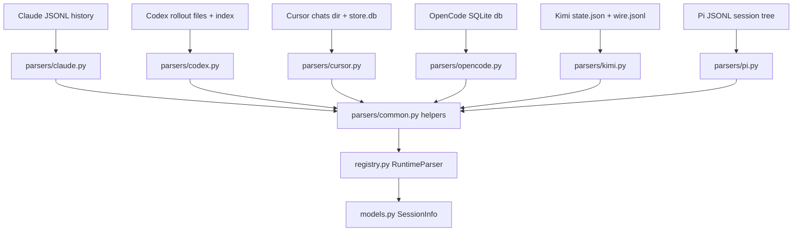

# Runtime Parsing Knowledge Base

## §0 Contents

| § | Title | When |
|---|------|------|
| §1 | Business background and core concepts | First contact with this domain |
| §1.5 | Architecture overview | Quick layered mental model (mermaid) |
| §2 | Core business flows / state machines | Main flows and status enums |
| §2.5 | Physical path cheat sheet | Locate code dirs directly (glob/ls) |
| §3 | Code entry index | Find entries by task scenario |
| §4 | Table and field entry index | When changing tables/fields/queries |
| §5 | Flow / component / job / MQ entry index | When changing orchestration / cron / messaging |
| §6 | Core business rules and hidden constraints | AI pitfalls to scan before changing code |
| §7 | Validation paths | How to verify correctness after changes |
| §8 | Related docs | Cross-domain reading guides |
| §9 | Coverage and to-be-filled items | Doc confidence and gaps |

## §1 Business background and core concepts

SessKit is a read-only Python library plus JSON CLI that parses local session
history files from six agent runtimes (canonical runtime ids: `claude`,
`codex`, `opencode`, `kimi`, `cursor`, `pi`) into one unified session schema.
It never launches agents, never resumes chats, and never writes history.

Each runtime persists history in its own native format and location (JSONL
files, SQLite databases, workspace-scoped directories). The runtime parsing
domain owns that native diversity: where each runtime keeps history, how the
scanner discovers sessions cheaply, how `load_conversation` reconstructs plain
`user` / `assistant` turns, and which native signals distinguish success from
abnormal endings (rate limit, quota, provider error, abort, interrupt).

Canonical terms used in body text: runtime (one of the six supported agent
products), native history (the on-disk files owned by that runtime), session
(scan-level metadata record), conversation (plain-text message list),
transcript event (rich `load_events` record), status tag (history-tail
inference `STATUS_DONE` / `STATUS_PENDING` / `STATUS_ABORTED` /
`STATUS_NONE`), excerpt (bounded 300-character list preview). Implementation
aliases (class, file, field names) appear verbatim only in entry indexes and
first-appearance parentheses.

Downstream consumers (CLIs, scripts, hosting layers, notification pipelines)
read SessKit output through the unified abstraction layer; this KB covers only
how each runtime is read, not how consumers present or host sessions.

### Runtime roster

| Runtime id | Display name | Native history shape |
|---|---|---|
| `claude` | Claude Code | Per-project JSONL session files |
| `codex` | Codex CLI | Rollout session files plus optional thread-name index |
| `cursor` | Cursor Agent | Workspace-hash chat dirs with meta, prompt history, and SQLite store |
| `opencode` | OpenCode | Single SQLite database with v1 and v2 table families |
| `kimi` | Kimi Code | Workspace session dirs with state metadata and wire protocol log |
| `pi` | Pi | JSONL session files forming a parent-linked message tree |

All six implement the same scanner interface (`scan_sessions`,
`load_conversation`, `scan_signature`) and return the same session record
shape; only the native reading differs.

## §1.5 Architecture overview

For status inference, each parser maps its native tail signals to the shared
`titles.py` status tags; the mapping table lives in §2.

## §2 Core business flows / state machines

### Scan flow (list path)

1. `RuntimeParser.scan_sessions()` calls the runtime `scan_sessions()` with
   `limit`, optional `keep_ids`, and `include_missing_cwd`.
2. Each scanner enumerates its native store (directory walk, SQLite query, or
   index file), builds one session record per history unit via its
   `_build_session_info()`, then applies shared filters: missing-`cwd` drop by
   default, ephemeral-workspace drop always, title-generation sessions dropped.
3. List excerpts (`first_user_msg` / `last_user_msg` / `last_agent_msg`) are
   clipped to 300 characters (`titles.py` excerpt limit). Handoff-wrapper
   digests are extracted before clipping so the window holds task text.
4. `scan_signature()` returns a cheap list-level version: it must stay stable
   under streaming writes (notably the Cursor WAL exclusion below).

### Load flow (conversation path)

1. Public entry `registry.py load_session_conversation()` accepts a session
   dict (`source`, `path`, `id`). Parser modules stay path-based; the OpenCode
   loader takes a database path plus session id.
2. Each `load_conversation()` opens its native history read-only, orders
   records in file order, keeps only `user` / `assistant` roles, drops empty
   text and literal `"None"`, and filters system-injection markers out of plain
   user turns.
3. Missing or unreadable history raises `ConversationLoadError` on the SessKit
   path so the CLI reports an error envelope; it is never disguised as a
   successful empty transcript.

### Per-runtime native signals

| Runtime | Native store | Success signal | Abnormal signal |
|---|---|---|---|
| `claude` | Per-project JSONL under the Claude projects dir; bounded 64 KB tail read | Assistant text tail, no error markers | System entries carrying upstream error text plus HTTP status; user-interrupt marker; assistant text starting with the session-limit prefix |
| `codex` | Rollout session files plus session index; shared process snapshot for liveness | `event_msg` / `task_complete` without `error` | Same completion event carrying a non-empty `error` (usage-limit, auth, provider); `turn_aborted` |
| `cursor` | Workspace-hash chat dirs (`meta.json`, newest-first `prompt_history.json`, `store.db` blobs) | Transcript / store tail with assistant text | Terminal reason unclear: prefer unknown over false done; error-only store tails surface through events |
| `opencode` | Single SQLite database, v1 tables plus v2 tables with dedup | Assistant message with stop finish and no `error` | Non-empty message `error` (provider error objects, abort errors); error text fills excerpts even for zero-text turns |
| `kimi` | Workspace session dirs (`state.json` metadata, `agents/main/wire.jsonl` protocol events) | Stable step-end / assistant tail | Cancel / failure markers in wire history |
| `pi` | JSONL session files forming a message tree | Assistant `stopReason` indicating stop with content | `stopReason` indicating error / abort plus `errorMessage` (for example rate-limit text) |

Pi list status must use terminal evidence on the active branch, not merely the
presence of assistant text. An assistant tail with content and native
`stopReason="stop"` may establish `STATUS_DONE`; `error` / `aborted` remain
`STATUS_ABORTED`, and a user-owned tail remains `STATUS_PENDING`. Assistant
tails ending in `toolUse`, `length`, `deferred`, `pending`, or with a missing or
unrecognized `stopReason` are unknown (`STATUS_NONE`), never done. An unconfirmed
or pending tail must not receive a `completion_id`; done and aborted tails retain
their stable terminal identity. This follows Pi's [official `StopReason` and
`AssistantMessage` types](https://github.com/earendil-works/pi/blob/main/packages/ai/src/types.ts)
and [persisted session format](https://github.com/earendil-works/pi/blob/main/packages/coding-agent/docs/session-format.md).
Local evidence: a bounded scan of 188 Pi histories found one exact active/file
tail ending in an assistant `toolUse` message whose content was only a `toolCall`
and which had no `errorMessage`; the `length`, `deferred`, `pending`, and missing-
reason cases were not observed in that sample and are fixture-covered.

Outcome projection for list consumers: a runtime's native successful terminal
assistant tail maps to `STATUS_DONE` (for Pi, specifically `stopReason="stop"`
with content); user-owned tail maps to `STATUS_PENDING`; any non-empty native
error maps to `STATUS_ABORTED` (or a future dedicated failure tag); genuinely
unclear or non-terminal tails map to `STATUS_NONE`. Uncertain evidence must
remain unknown, never default to success.

### Title and excerpt pipeline

Native titles are preferred when present; otherwise the fallback title derives
from the first meaningful user text. The pipeline normalizes slash-command
labels, strips mention prefixes, skips bare URLs, and filters automated
title-generation sessions out of listings entirely. Bracketed JSON or array
fragments remain low-value title candidates and must not outrank real prompts.
For handoff-style wrappers, the inherited task line plus conversation digest
are extracted before the 300-character clip; nested wrappers flatten to one
line with the inner task winning and leftover pickup phrasing dropped.

### Liveness pipeline

Liveness never launches processes. Scanners snapshot the process table once
per scan, resolve command lines and initial environ for candidate agent
processes, match open history paths or explicit session-id flags, and mark
`live` plus `pid` on the matching session record. Sub-agent style chats are
attributed to their root parent session so the list shows progress on the
parent while the child still works. A missing short process-name match alone
never proves termination; open-file evidence outranks the name match.

## §2.5 Physical path cheat sheet

| Directory (relative to project root) | Contents | Key classes / file count |
|------|------|--------|
| `src/sesskit/parsers/` | All six runtime scanners plus shared helpers | 8 Python files: `claude.py`, `codex.py`, `cursor.py`, `opencode.py`, `kimi.py`, `pi.py`, `common.py`, `__init__.py` |
| `src/sesskit/parsers/claude.py` | Claude JSONL scan/load, head+tail fast read, image-marker and queued-prompt handling | `scan_sessions()`, `load_conversation()`, `scan_signature()`, `_build_session_info()`, `_read_head()`, `_read_tail()`, `_backfill_excerpts()` |
| `src/sesskit/parsers/codex.py` | Codex rollout scan/load, index mapping, liveness via open files | `scan_sessions()`, `load_conversation()`, `scan_signature()`, `_build_session_info()`, `_live_session_ids()`, `task_complete_error_text()` |
| `src/sesskit/parsers/cursor.py` | Cursor chat-dir scan, read-only `store.db` preview, prompt-history fallback | `scan_sessions()`, `load_conversation()`, `scan_signature()`, `_build_session_info()`, `_prompt_history()` |
| `src/sesskit/parsers/opencode.py` | OpenCode SQLite v1+v2 scan/load, overfetch-then-filter, join-order handling | `scan_sessions()`, `load_conversation()`, `scan_signature()`, `_build_session_info()`, `_build_session_info_v2()`, `connect_ro()`, `error_text_from_msg()` |
| `src/sesskit/parsers/kimi.py` | Kimi state+wire scan/load, cheap pre-filter before JSON parse | `scan_sessions()`, `load_conversation()`, `scan_signature()`, `_build_session_info()`, `iter_message_entries()`, `user_text()` |
| `src/sesskit/parsers/pi.py` | Pi JSONL tree scan/load, active-branch reconstruction | `scan_sessions()`, `load_conversation()`, `scan_signature()`, `read_entries()`, `active_messages()`, `_build_session_info()` |
| `src/sesskit/parsers/common.py` | Shared helpers: cwd display, ephemeral check, timestamps, tool-kind map, process snapshot | `is_ephemeral_agent_cwd()`, `shorten_cwd()`, `parse_timestamp()`, `classify_tool()`, `live_pid_snapshot()`, `stat_signature()` |

## §3 This domain's code entry index

| Scenario | Entry | Class/method/config | Notes |
|---|---|---|---|
| Scan Claude sessions | `src/sesskit/parsers/claude.py` | `scan_sessions()` | Head (bounded lines) plus 64 KB tail; overfetch is unnecessary here because files are per-session |
| Preview Claude conversation | `src/sesskit/parsers/claude.py` | `load_conversation()` | File order; queued mid-turn prompts count as user messages; companion queue-operation rows ignored to avoid duplicates |
| Scan Codex sessions | `src/sesskit/parsers/codex.py` | `scan_sessions()` | Rollout files plus optional session index for thread names; liveness from shared process snapshot before open-file inspection |
| Preview Codex conversation | `src/sesskit/parsers/codex.py` | `load_conversation()` | Head+tail reads; response payload text extraction per role; completion error text helper for abnormal ends |
| Scan Cursor sessions | `src/sesskit/parsers/cursor.py` | `scan_sessions()` | Light list path reads only `meta.json` and `prompt_history.json`; `store.db` untouched at list time |
| Preview Cursor conversation | `src/sesskit/parsers/cursor.py` | `load_conversation()` | Read-only SQLite open; JSON blob role filtering; binary DAG blobs skipped; prompt-history fallback when store has no message events |
| Scan OpenCode sessions | `src/sesskit/parsers/opencode.py` | `scan_sessions()` | Dual v1/v2 table branches with dedup; overfetch multiplier then title-noise filter then trim to limit |
| Preview OpenCode conversation | `src/sesskit/parsers/opencode.py` | `load_conversation()` | Takes database path plus session id; v1 text parts and v2 typed rows normalized to plain turns |
| Scan Kimi sessions | `src/sesskit/parsers/kimi.py` | `scan_sessions()` | `state.json` metadata preferred; wire file scanned via cheap substring pre-filter before JSON parse |
| Preview Kimi conversation | `src/sesskit/parsers/kimi.py` | `load_conversation()` | Main-agent wire only; system-injected context events and tool snapshots skipped; think parts skipped |
| Scan Pi sessions | `src/sesskit/parsers/pi.py` | `scan_sessions()` | JSONL entries read then active branch resolved; liveness via command-line pinning and session-dir environ |
| Preview Pi conversation | `src/sesskit/parsers/pi.py` | `load_conversation()` | `active_messages()` then `read_entries()` order; `include_errors` brings back error-only turns hidden by default |
| Shared ephemeral check | `src/sesskit/parsers/common.py` | `is_ephemeral_agent_cwd()` | Manager-job path segments plus marker-file ancestor walk; honours the process-local opt-in env flag |
| Shared tool-kind map | `src/sesskit/parsers/common.py` | `classify_tool()` | Name-to-kind table (read/edit/write/shell/search/web/task/todo/question); unknown names map to generic |
| Shared process snapshot | `src/sesskit/parsers/common.py` | `live_pid_snapshot()` | One snapshot reused across scanners to avoid repeated forks during background rescans |
| List-version signal | each parser module | `scan_signature()` | List-level version for change detection; Cursor variant excludes the streaming WAL file |
| Delete session file | `codex.py`, `kimi.py`, `pi.py` | `delete_session()` | Test and maintenance helper; production CLI never deletes history |
| Clone session record | `kimi.py` | `clone_session()` | Test helper duplicating a session record shape |
| File-change signature | `src/sesskit/parsers/common.py`, `src/sesskit/cache.py` | `stat_signature()`, `file_signature()` | Device plus inode plus size plus mtime-ns; used for cache keys and change detection |
| Timestamp parsing | `src/sesskit/parsers/common.py` | `parse_timestamp()` | ISO-8601 with trailing `Z` handled; malformed input returns `None` rather than raising |
| Cwd display | `src/sesskit/parsers/common.py` | `shorten_cwd()` | Home-directory prefix replaced with `~` for list display only; stored `cwd` keeps the full path |
| Open-file enumeration | `src/sesskit/parsers/common.py` | `open_file_paths()`, `live_processes()`, `process_command_line()`, `process_environ()` | Shared liveness inputs; results cached per scan to avoid repeated forks |

## §4 This domain's table and field entry index

There is no relational database in this project. This section indexes the key
native-history fields each parser reads, with types and change notes.

| Native field | Parser / location | Business meaning | Change notes |
|---|---|---|---|
| Claude `aiTitle` | `src/sesskit/parsers/claude.py` native title preference | Authoritative native title; preferred over derived titles | Do not read a generic `title` key; the native name is specific |
| Claude attachment `queued_command` prompt | `src/sesskit/parsers/claude.py` queued-prompt handling | Mid-turn human prompt typed while the agent works; real user message | Must appear in conversation, events, and list tail in file order; ignore companion queue-operation rows |
| Claude leading image marker plus human text | `src/sesskit/parsers/claude.py` title fallback | Image-first session with real human text after the marker | Strip only leading markers for fallback titles; keep full prompt in history; never drop the session |
| Claude system `error.formatted` / `error.status` | `src/sesskit/parsers/claude.py` abnormal mapping | Upstream failure text plus machine status code | Maps to `STATUS_ABORTED`; retry bursts collapse to one trailing error; titles never use error text |
| Claude `continued-in` forward pointer | `src/sesskit/parsers/claude.py` continuation scan, `src/sesskit/relations.py` | Old session file carries `{"type":"continued-in","sessionId":<old>,"continuedInSessionId":<new>}` when the conversation moves to a new file (observed with background sessions on 2.1.284: resume-with-`--bg` may continue under a new id, see agent-view changelog v2.1.257) | Emits `SessionRelation(kind="continuation", target=<new>)`; sets optional `superseded_by` only when the target file exists on disk; missing targets stay unknown; chains resolve with a cycle guard; listing keeps but flags, never hides |
| Claude `session_id` back-pointer | `src/sesskit/parsers/claude.py` continuation scan | Continued file records carry both `sessionId` (own id) and snake-case `session_id` (parent id), plus `sessionKind: "bg"` on background sessions | Corroborating evidence for the forward pointer; a back-pointer differing from the file id also exempts the file from the early-`agent-name` internal-session filter (bg-continuation metadata blocks precede the first user message) |
| Codex `event_msg` / `task_complete` / `error` | `src/sesskit/parsers/codex.py` completion mapping | Success versus failure completion record | Non-empty `error` forces `STATUS_ABORTED` even when a complete marker exists; error text fills excerpts when no assistant text exists |
| Codex `turn_aborted` | `src/sesskit/parsers/codex.py` abort mapping | Explicit turn-abort signal | Always abnormal; never map to done |
| Cursor `meta.json` title / cwd / timestamps | `src/sesskit/parsers/cursor.py` list build | Lightweight list source; full text not read at list time | Keep list path off `store.db` or first paint regresses |
| Cursor `prompt_history.json` (newest-first) | `src/sesskit/parsers/cursor.py` fallback | User inputs when store has no parseable message events | Emit oldest-first as user events; never append to a non-empty store stream or duplicate users |
| Cursor store-only sessions (no meta title, no prompt history) | `src/sesskit/parsers/cursor.py` store-backed list fallback | Fresh `--print` one-shots that only wrote `meta.json` + `store.db` | List with `STATUS_NONE`, empty excerpts/title when `store.db` holds ≥1 blob (single-row `meta` read + existence probe only, generic `"New Agent"` ignored); empty shells and missing stores stay unlisted |
| Cursor `store.db` JSON blobs | `src/sesskit/parsers/cursor.py` preview | Full conversation blobs plus binary DAG blobs | Parse role-bearing JSON blobs; skip binary DAG blobs; open read-only |
| OpenCode v1 `session` / `message` / `part` | `src/sesskit/parsers/opencode.py` v1 branch | Legacy table family retained for old rows | Preserve v1 query behavior; new sessions land in v2 |
| OpenCode v2 `session_v2` / `session_message` | `src/sesskit/parsers/opencode.py` v2 branch | Current table family | Dedup against v1 ids so migrated rows never list twice |
| OpenCode message `error` object | `src/sesskit/parsers/opencode.py` abnormal mapping | Provider / abort error with message plus status code | Maps to `STATUS_ABORTED`; fills excerpts even for zero-text turns |
| Kimi `state.json` title / cwd / times / last prompt | `src/sesskit/parsers/kimi.py` list build | Small authoritative list source | Prefer state over wire for metadata; text still comes from wire |
| Kimi `context.append_message` user parts | `src/sesskit/parsers/kimi.py` user extraction | User message with text shards | Discard non-user-origin injected events; keep text shards only |
| Kimi `context.append_loop_event` content parts | `src/sesskit/parsers/kimi.py` assistant extraction | Assistant text versus think shards | `text` parts are conversation; `think` parts are thinking events, not chat text |
| Pi message-tree `parentId` chain | `src/sesskit/parsers/pi.py` branch resolution | Active branch linkage across file entries | Start from the last appended file entry then walk parents; never pick the leaf by max wall-clock timestamp |
| Pi assistant `stopReason` plus `errorMessage` | `src/sesskit/parsers/pi.py` outcome mapping | Stop versus error / abort outcome plus human-readable failure | Error stop maps to `STATUS_ABORTED` with retained error text; plain conversation hides error-only turns unless explicitly requested |
| Codex session index thread names | `src/sesskit/parsers/codex.py` index mapping | Human thread names joined onto rollout sessions | Index is advisory only; missing index never drops a session |
| Claude session-slug titles | `src/sesskit/parsers/claude.py` slug detection | Machine slug that must not become the display title | Slug-shaped candidates lose to real prompt text during fallback choice |
| Cursor sub-agent chats | `src/sesskit/parsers/cursor.py` list filter | Child-agent chats excluded from listings | Liveness on a child chat attributes to the root parent instead |
| Kimi sub-agent wire files | `src/sesskit/parsers/kimi.py` wire selection | Side-channel agent transcripts ignored by scan and preview | Only the main-agent wire feeds sessions and conversations |
| OpenCode v1/v2 join order | `src/sesskit/parsers/opencode.py` scan query | Migration dedup ordering between table families | V2 takes only ids absent from v1; reversing the order duplicates migrated rows |
| Pi hosted isolation dirs | `src/sesskit/parsers/pi.py` hosted handling | Isolation-directory sessions separated from plain sessions | Keep the isolation check aligned with the hosted helper semantics |
| Claude `message.usage` / `message.model` | `src/sesskit/activity.py` assistant usage | Per-message input/output/cache tokens plus model id on every assistant message | Never estimate; attach as `Usage` with native evidence only |
| Claude `isCompactSummary` / `compactMetadata` | `src/sesskit/activity.py` compaction marker | System-generated continuation summary in the user channel | Keep projected as today; mark `origin=system` plus `CompactionInfo`, never retype |
| Claude `Agent` tool calls / `continued-in` entries | `src/sesskit/relations.py` claude relations | Child-agent delegation (no persisted child id) and forward resume pointers | Subagent target stays None; continuation target is the native session id |
| Claude `origin.kind` / `humanTurn` | `src/sesskit/parsers/claude.py` queued-prompt handling | Explicit human evidence versus hook-injected notifications on the shared channel | Missing origin stays `unknown`; wrapper-only rows surface as `injected` |
| Codex `token_usage_record` | `src/sesskit/activity.py` turn usage | Per-turn token counts with `turn_id` / `thread_id` linkage | Attach only on native turn-id match; unmatched turns keep no usage |
| Codex `compacted` rows | `src/sesskit/activity.py` compaction events | Compaction boundary with `replacement_history` | Typed-only `compaction` events; v1 never carried them |
| Codex `thread_source` | `src/sesskit/parsers/codex.py` subagent handling | `user` / `voice_chat` / `subagent` thread origin | Subagent threads report a relation with no persisted parent id |
| Codex `# AGENTS.md instructions` / `<environment_context>` | `src/sesskit/activity.py` injected user events | Framework-injected user-channel blocks dropped from conversation | Typed-only `injected` user events; never heuristic-filtered |
| OpenCode `parent_id` / `fork_session_id` / `fork_boundary` | `src/sesskit/relations.py` opencode relations | Session-level parent and fork linkage | Fork keeps kind `fork`; plain parents stay `unknown`; scanner lists top-level sessions only |
| OpenCode message `modelID` / `model` / `tokens` / `cost` | `src/sesskit/activity_opencode.py` assistant usage | Per-message model plus input/output/reasoning/cache tokens plus cost | Both v1 and v2 layouts; attach as `Usage` with native evidence |
| OpenCode `compaction` / `subtask` parts | `src/sesskit/activity_opencode.py`, `src/sesskit/relations.py` | Compaction text and child-agent delegation records | Compaction keeps its projected kind plus a marker; subtask yields a target-less subagent relation |
| Cursor `<user_info>` / `<user_query>` | `src/sesskit/activity_cursor.py` user origin | Injected context blocks versus explicit genuine-input wrapper | `user_query` content is human; dropped context blocks surface as `injected` |
| Pi assistant `usage` / `model` / `provider` | `src/sesskit/activity.py` assistant usage | Per-message tokens plus model/provider/api on every assistant message | Attach as `Usage`; cost reads from `usage.cost.total` |
| Pi `compaction` entries | `src/sesskit/activity.py` compaction events | Boundary with `summary`, `tokensBefore`, and `usage` | Emitted only when feeding the active branch; typed-only in v1 |
| Pi `subagents:record` custom entries | `src/sesskit/relations.py` pi relations | Child-agent records with native child ids | Target is the record id; status text is not parsed |

## §5 This domain's flow / component / job / MQ entry index

No message queues, cron jobs, or flow engines exist here. This section indexes
the discovery, liveness, and version flows that behave like cross-cutting
pipelines.

| Type | Id | Code entry | When used |
|---|---|---|---|
| Discovery | Per-runtime native enumeration | `scan_sessions()` in each parser module | Every `list` / `search` call; registry fans out across runtimes in a thread pool |
| Liveness | Open-file plus command-line pinning | `_live_session_ids()` in `claude.py` / `codex.py`, `_apply_live_flags()` in `opencode.py` / `kimi.py` / `cursor.py`, `_mark_live()` helpers | Marking `live` plus `pid` on session records without launching anything |
| Version | List-level `scan_signature` | `scan_signature()` in each parser module | Cheap list-change detection; Cursor variant excludes the streaming WAL so live writes do not invalidate the whole list every few seconds |
| Version | Conversation-level `extra_version` | Cursor scanner cache key including WAL state | Preview freshness for uncheckpointed tails; never collapse with the list-level key |
| Cache | Session / conversation cache slots | `src/sesskit/cache.py` `file_signature()`, `NullSessionCache` | Default no-op cache; file signature is device plus inode plus size plus mtime-ns |
| Filter | Missing-directory drop | `include_missing_cwd` parameter on scanners | Default drops sessions whose project directory no longer exists; archive flows opt in explicitly |
| Filter | Ephemeral-workspace drop | `src/sesskit/parsers/common.py` `is_ephemeral_agent_cwd()` | Always drops manager-job and marker-ignored workspaces regardless of the missing-directory flag |
| Filter | Title-generation sessions | `src/sesskit/titles.py` `is_title_generation_prompt()` | Drops automated title-generation histories from listings |
| Clock | Event-time versus file-mtime | `effective_session_time()` in `src/sesskit/models.py` | Display and ordering prefer native event time with file mtime as fallback; never assume wall clocks agree across machines |
| Identity | Short-id derivation | `session_key()` plus short-id helpers in `src/sesskit/models.py` | Short ids are display shortcuts; full ids remain the lookup key and prefix matching resolves ambiguity explicitly |

### Error-text retention

Abnormal endings keep their human-readable error text in list fields and rich
events. When native history carries an error but no assistant text, the error
text fills the excerpt and event stream so the failure stays visible; titles
still use the real user prompt and never adopt error text. Retry bursts
collapse to one trailing error rather than one event per attempt. Plain
conversation views may hide error-only turns by default for chat readability,
with an explicit flag to bring them back where the runtime supports it.

## §6 Core business rules and hidden constraints

- **AI pitfall** 【Forbidden】Treat an image-first Claude prompt as noise or drop the session -> must strip only leading image markers for the fallback title and keep the full prompt in history (reason: the marker plus human text is a real session; dropping it loses recoverable history).
- **AI pitfall** 【Hidden dependency】Before trusting a tool-heavy Claude tail, backfill excerpts from a wider backward read, but keep status and completion identity on the original bounded window -> else a mid-turn assistant sentence becomes a false `STATUS_DONE` and a false completion notification.
- **AI pitfall** 【Forbidden】Resume a Claude session by its scanned id without checking the `continued-in` chain -> must resolve through `superseded_by` / `resolve_continuation()` first (reason: background resume may continue the conversation under a new id; the old id still opens but misses everything written to the new file). The pointer may sit outside the head+tail scan windows, so the continuation sweep reads the full file with a `continued-in` substring pre-filter and stays cached per path; missing targets and cycles resolve to the last readable id, never an error.
- **AI pitfall** 【Implicit semantics】Cursor list versioning automatically excludes the streaming WAL while conversation versioning automatically includes it at `parsers/cursor.py scan_signature()`; when changing either version key also check the other, else live writes either spam list rescans or stale previews serve checkpointed text only.
- **AI pitfall** 【Forbidden】Drop a Cursor chat from listings just because `meta.json` has no title and `prompt_history.json` is absent -> when `store.db` holds message blobs the session is real (fresh `--print` one-shots, 2026-09-30 live evidence) and must list with `STATUS_NONE` plus empty excerpts/title; only blob-less shells and missing stores stay unlisted. Never scan blobs or fabricate excerpts at list time to fill the row.
- **AI pitfall** 【Forbidden】Hide sessions by temp-directory prefix alone -> must use the two real ephemeral signals only (manager-job path segment, marker file in cwd or ancestors); people run real sessions from temp dirs and would lose them.
- **AI pitfall** 【Hidden dependency】Before listing automation-owned workspaces, check the process-local opt-in flag handling in `parsers/common.py is_ephemeral_agent_cwd()`; the flag is per-process only and must never be set globally, else ignored sessions leak into every listing.
- **AI pitfall** 【Implicit semantics】Pi branch resolution automatically follows the last-appended file entry through `parentId` at `parsers/pi.py active_messages()`; when changing branch logic also check clock-skew cases, else max-timestamp leaf selection picks the wrong branch.
- **AI pitfall** 【Implicit semantics】Codex liveness checks the shared process snapshot plus open history files before trusting a process-name match at `parsers/codex.py _live_session_ids()`; a missing short-name match alone is not evidence the task ended because long executable paths are missed.
- 【Forbidden】Pass a whole session dict into `parsers.*.load_conversation` -> must go through the public session-dict adapter `registry.py load_session_conversation()`; parser modules stay path-based (OpenCode takes database path plus session id).
- 【Forbidden】Disguise missing or unreadable history as a successful empty transcript on the SessKit path -> must raise `ConversationLoadError` so the CLI returns an error envelope; empty means a readable history with zero normalized events.
- 【Hidden dependency】Before clipping list excerpts, extract the handoff-wrapper `Task:` line and conversation digest; otherwise the 300-character window fills with pickup boilerplate and title generation never sees the real request. Nested wrappers peel inward with the inner task winning.
- 【Disambiguation】List excerpts versus status inputs: excerpts may use the wider backfill read, but status tags and completion identity must use the original bounded window only. They are not interchangeable; mixing them creates false-done notifications.
- 【Disambiguation】Queued mid-turn prompts versus queue-operation rows: the former are real user messages in file order; the latter are companions to ignore. Counting both duplicates the user turn.
- 【Naming alignment】Excerpt and status vocabulary (`first_user_msg`, `last_user_msg`, `last_agent_msg`, `status_tag`, `completion_id`, `scan_signature`, `extra_version`) may also appear under native names in history files; body text always uses the unified names and entry indexes locate native spellings.
- **AI pitfall** 【Implicit semantics】OpenCode title-noise rows automatically sort first by recency at `parsers/opencode.py` scan time, so a bounded SQL window fills with one-shot generation tasks; when changing scan limits also keep the overfetch-then-filter step, else real sessions get pushed out of the window and the list flickers at the boundary.
- **AI pitfall** 【Hidden dependency】Before reading Kimi wire history, apply the cheap type-substring pre-filter at `parsers/kimi.py iter_message_entries()`; parsing every line as JSON first makes scans slow because system prompts and tool snapshots dominate the file.
- 【Low confidence】Kimi cancel and failure marker coverage is bounded by observed wire samples; new wire shapes may need additional abnormal mappings (evidence: `src/sesskit/parsers/kimi.py` wire filters; pending: broader live failure samples).
- **AI pitfall** 【Forbidden】Estimate or synthesize token/cost usage for messages or turns that carry no native record -> `Usage` attaches only to matching native records; unmatched turns carry none (native-only, no estimates — see [Agent Session Integration Guide](~/.config/agentsync/docs/AGENT_SESSION_INTEGRATION_GUIDE.md#recorded-usage-and-estimates)). Observed partial coverage: Codex turn records cover only a fraction of turns.
- **AI pitfall** 【Forbidden】Retype an already-projected compaction row (Claude compact summary, OpenCode compaction part) into a new event kind -> must keep the projected kind and attach a `CompactionInfo` marker, else v1 bytes shift; only never-projected rows (Codex `compacted`, Pi `compaction` entries) become standalone `compaction` events.
- **AI pitfall** 【Implicit semantics】`to_v1_dicts` renumbers projected `seq` densely from 1; when adding typed-only events also check `conversation_from_activity` skips them the same way, else chat views and v1 transcripts diverge on injected rows.
- 【Disambiguation】Relation kind versus relation target: `fork` needs explicit fork fields, `subagent` needs delegation evidence, `continuation` needs a forward pointer; a bare parent link keeps kind `unknown` with the native target id rather than guessing resume or handoff.
- - 【Ruling】[2026-09-29] User confirmed SessKit is a standalone library plus JSON CLI with no downstream-host coupling: no downstream product names, host-specific paths, or host-owned semantics belong in SessKit docs, code, or schemas. Prior materials referenced a specific downstream consumer by name; that coupling is the removal target. Future doc work must not reintroduce named downstream references unless the user explicitly reverses this decision; any host integration stays outside this repository.

## §7 Common easy-to-miss conditions and validation paths

- After changing any parser scan path: run `python3 -m pytest tests/test_registry_load.py -q` and check the real-adapter wiring tests pass (they exercise the registry adapter, not session-dict stubs).
- After changing status or excerpt logic: run `python3 -m pytest tests/test_abnormal_endings.py tests/test_excerpt_clip.py tests/test_claude_excerpt_backfill.py -q` and confirm abnormal ends still map to aborted rather than done.
- After changing transcript or tool mapping: run `python3 -m pytest tests/test_transcript.py tests/test_transcript_opencode_v2.py -q` and confirm event counts and role filtering hold.
- After changing Cursor or OpenCode versioning: run `python3 -m pytest tests/test_scan_opencode_join_order.py tests/test_scan_opencode_v2.py -q` plus a live two-step check: `sesskit list --top 5 --compact`, then `sesskit show <session-id> --full`, and confirm the preview reflects uncheckpointed tails without list spam.
- After changing Pi branch or error handling: run `python3 -m pytest tests/test_activity.py -q` and sample the exact live Pi session file through `load_session_conversation` plus `load_events`, asserting `status_tag`, `last_agent_msg`, and trailing error events on the same path.
- After changing Codex liveness: run `python3 -m pytest tests/test_codex_liveness.py tests/test_process_snapshot.py tests/test_completion_id.py -q` and verify live marking against open rollout files rather than process-name matches alone.
- Live runtime sweep (required when parsers change and histories exist): for every installed runtime with sessions, verify `load_session_conversation` succeeds, roles are only `user` / `assistant`, no empty text, no literal `"None"`, no system-injection markers in plain user turns, and every plain user text appears in `load_events` user texts. Prefer one fresh success prompt plus one reproducible abnormal prompt per runtime on the exact session path.
- After changing ephemeral or missing-directory filters: run `python3 -m pytest tests/test_ephemeral_workspace.py -q` and manually verify a manager-job path plus a marker-ignored workspace stay unlisted even with the archive flag, while a real session under a temp dir still lists.
- After changing titles or handoff extraction: run `python3 -m pytest tests/test_excerpt_clip.py tests/test_completion_id.py -q` and verify handoff digests surface inside the 300-character window with completion identity computed from the bounded tail only.
- Note: fixture-only green runs never prove real wiring; the registry-load tests plus the per-runtime live checks above are both required before claiming parse correctness.
- Portable semantic regressions for migrated runtimes must use compact synthetic native histories and literal, hand-checked expected outcomes, errors, event content, and correlation values; do not derive expected values from the parser, activity loader, or v1 projection under test. Exercise the public adapter and session-dict registry load paths so the test checks both interpretation and wiring. These goldens catch stable semantic regressions and complement (not replace) internal-consistency/conformance tests and exact-session live checks; synthetic histories are not live clones and cannot establish live correctness. Run the focused suite with `.venv/bin/python -m pytest tests/test_runtime_goldens.py -q`, then run affected registry/activity suites and the required live checks when parser or load wiring changes.
- A release containing verifier/conformance repairs must include independent portable semantic regressions as well as the verifier checks. Release notes must distinguish synthetic and internal-consistency evidence from exact-session live evidence, name material live checks that remain unverified, and never imply that fixtures establish live correctness.

## §8 Related docs

- `docs/UNIFIED_ABSTRACTION_KNOWLEDGE_BASE.md`: covers the unified session, conversation, transcript, activity, outcome, and schema contracts this domain feeds; read together when changing shared status or event semantics.
- `docs/LISTING_CLI_EXPORT_KNOWLEDGE_BASE.md`: covers list, search, show, export, share, and describe behavior built on top of these scanners; read together when changing scan filters or excerpt rules.
- `docs/CONTRACT.md`: covers the file-level contract (envelope, schemas, load wiring, listing modes, write safety, status semantics, verification); read before changing parser or load behavior.

## §9 Coverage and to-be-filled items

- Code-inference coverage: six runtime scanners plus shared helpers traced from native enumeration through session records to plain-turn loads; per-runtime success and abnormal signals mapped; liveness and version flows indexed.
- Domain-language unification: unified terms (`runtime`, `native history`, `session`, `conversation`, `transcript event`, `status tag`, `excerpt`) used in body; native spellings kept verbatim in §4; no separate glossary.
- User / materials: product definition confirmed 2026-09-29 (standalone library plus JSON CLI; six runtimes; no downstream coupling); hotspot priority confirmed (Pi / Claude / OpenCode most error-prone); local-run validation allowed; known trap list accepted as sufficient.
- Multi-source evidence enrichment: tests read (`test_registry_load`, `test_abnormal_endings`, `test_transcript`, `test_transcript_opencode_v2`, `test_scan_opencode_v2`, `test_scan_opencode_join_order`, `test_codex_liveness`, `test_process_snapshot`, `test_activity`, `test_excerpt_clip`, `test_claude_excerpt_backfill`); contract status and listing sections cross-checked; live-history sampling still pending in this doc session.
- Q&A supplements: 1 product ruling (standalone decoupling), 1 priority confirmation, 1 validation allowance; no additional hidden-constraint Q&A needed beyond code evidence.
- To be filled: broader live failure samples for Kimi cancel paths; additional Cursor terminal-reason evidence to strengthen weak list status; measured per-runtime tail-read latency baselines.
- Coupling inventory (removal target, not this doc batch): named downstream references still present in code and older docs (scanner docstrings, hosted env helpers, hosted claim layouts, cache injection docstring, title-filter comments, legacy payload ids, older contract paragraphs, packaging notes). New KBs avoid them; code and contract cleanup belongs to a dedicated decoupling change with its own verification.

<!-- Generated by doc-init on 2026-09-29; positioning: quick reference before AI changes this business domain -->
