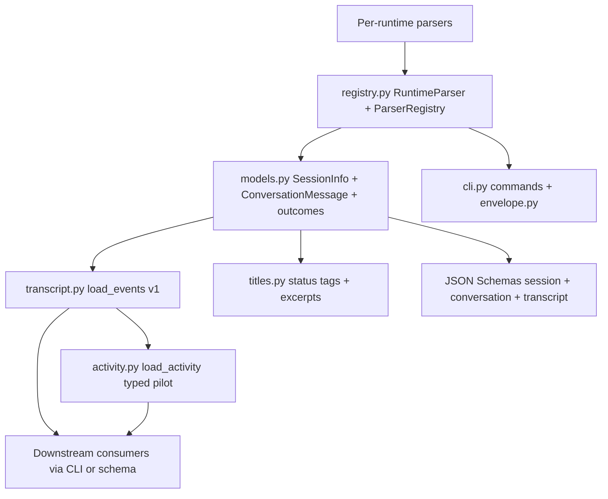
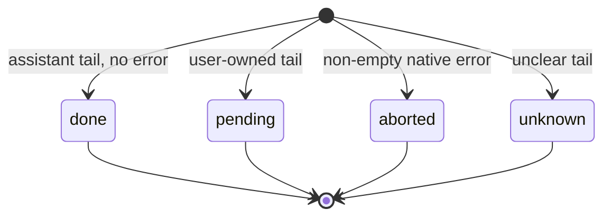

# Unified Abstraction Knowledge Base

## §0 Contents

| § | Title | When |
|---|------|------|
| §1 | Business background and core concepts | First contact with this domain |
| §1.5 | Architecture overview | Quick layered mental model (mermaid) |
| §1.6 | Ownership boundary and optional host extension | Distinguish native history from host-owned behavior |
| §2 | Core business flows / state machines | Main flows and status enums |
| §2.5 | Physical path cheat sheet | Locate code dirs directly (glob/ls) |
| §3 | Code entry index | Find entries by task scenario |
| §4 | Table and field entry index | When changing tables/fields/queries |
| §5 | Flow / component / job / MQ entry index | When changing orchestration / cron / messaging |
| §6 | Core business rules and hidden constraints | AI pitfalls to scan before changing code |
| §6.5 | Migration plan and unresolved decisions | Host-decoupling sequence and compatibility gates |
| §7 | Validation paths | How to verify correctness after changes |
| §8 | Related docs | Cross-domain reading guides |
| §9 | Coverage and to-be-filled items | Doc confidence and gaps |

## §1 Business background and core concepts

SessKit unifies six heterogeneous agent-runtime histories behind one stable
abstraction so scripts and downstream consumers read sessions, conversations,
and activity events without learning each native format. The abstraction has
four layers: session identity and metadata (`SessionInfo`), plain conversation
(`ConversationMessage`), rich transcript events (v1 dicts), and the additive
typed activity view (`ActivitySnapshot` with evidence, outcomes, and structured
errors). JSON Schemas plus a single CLI envelope make the contract consumable
from any language by shelling out.

Canonical terms in body text: session (one scanned history unit with stable
`source` plus `id`), conversation (ordered plain `user` / `assistant` turns),
transcript event (one v1 record with `type`, `seq`, optional `ts`), activity
snapshot (typed load result with `state` plus `events` plus `outcome`),
evidence (native / inferred / unknown origin with optional field and record
pointers), outcome (history-tail status `done` / `pending` / `aborted` /
`unknown`), agent error (structured failure kept separate from assistant text),
tool-result outcome (tool status plus its evidence), completion identity
(stable per-round terminal marker), scan signature (list-level version),
extra version (conversation-level version including streaming state).
Implementation names appear verbatim only in entry indexes and at first mention.

This KB owns the unification design: how one abstraction covers all runtimes,
metadata, and outcomes. Native per-runtime reading lives in the runtime parsing
KB; list, search, and export command behavior lives in the listing and CLI KB.

Language-agnostic consumers have two supported paths: shell out to the `sesskit`
CLI and parse the envelope, or reimplement parsers against the JSON Schemas
with the Python package as the reference implementation.

## §1.5 Architecture overview

History-tail outcome never describes process liveness. Current scanners also
attach `live` and `pid` fields to session records; the target ownership boundary
for those fields is described below.

## §1.6 Ownership boundary and optional host extension

### Target design

SessKit owns interpretation of native runtime history: native session identity,
metadata, ordered conversation and activity, and generic evidence about outcomes,
errors, tool results, and structured interaction requests. It reports what the
persisted history supports and preserves uncertainty; it does not decide what a
host should do with that evidence.

The consuming host owns hosted-session identity and ownership, question or
permission submission, remote/mobile message rendering, host attention state,
and notification policy and delivery. A normalized interaction request records
what history shows; it is not an API for submitting an answer. A history outcome
is not a host job phase and must not itself trigger a notification.

Process observation is distinct from hosted ownership. SessKit may expose generic
process evidence—such as an observed process identifier, native session selector,
or open native-history location—when available, with its source and uncertainty.
That evidence can support runtime liveness and native session association; it
does not prove which host operation owns the process, whether a hosted session is
provisional, or what attention state the host should show. These concepts must
not be folded into the native session ID or history outcome.

An optional host extension is a proposed integration seam, not a current API. It
must be supplied per registry or scan (never installed as process-global host
state), opt-in, and absent by default. If a host needs association, it may receive
typed process evidence and return an opaque host-side association kept separate
from native session identity. Optional listing policies and a session-cache
implementation may also be injected through declared interfaces. Extensions
must not alter native parsing, manufacture evidence, mutate history, or add host
fields to the stable v1 payload. A host that only consumes native history needs
no extension. Question submission, transport, presentation, and notifications
remain outside SessKit rather than becoming extension callbacks into core code.

### Current implementation (S2b: host coupling removed from `src`/`schemas`)

`grep -rni corral src schemas` returns nothing. Host env keys, claim
layouts, isolation conventions, the cache override, and the legacy wire id
no longer exist in SessKit core defaults; each is supplied per scan by the
host extension. The table below records what each item became.

| Former item | Status | Boundary |
|---|---|---|
| Runtime-native ids, command-line selectors (`--session`, `--resume`), process ids, open-history paths, and the generic `live` / `pid` observations | Generic — kept | Native session/process evidence; never proves host ownership. |
| `XDG_CACHE_HOME`, `SESSKIT_CACHE_DIR`, `SESSKIT_INCLUDE_EPHEMERAL`, `SESSKIT_SESSION_ID`, `SESSKIT_RUNTIME`, `PI_CODING_AGENT_DIR`, `PI_CODING_AGENT_SESSION_DIR`, and OpenCode's `OPENCODE_DATA_DIR` | Generic configuration — kept | Library, platform, or runtime settings. `process_environ` always reads these; nothing else without declaration. |
| `.sesskit-ignore` marker, `SESSKIT_INCLUDE_EPHEMERAL`, and the generic missing-`cwd` listing option | Generic listing policy — kept | Caller-controlled SessKit behavior. |
| `hosted.py` (host env keys, `corral-`/`pickup-` prefixes, `CORRAL_CACHE_DIR` fallback) | Deleted | Host keys/prefixes/overrides live in the host's extension (`env_keys`, `is_isolation_dir`, own cache chain). `sesskit.cache.cache_dir()` is the neutral default. |
| `pi_claims.py` (`corral-session-identity` layout, protocol/TTL validation) | Deleted | Claim reading/validation is host-owned; SessKit accepts neutral claim dicts via `pi_claims_provider` only. No importer remains on either side. |
| Host session-id matching in OpenCode, Cursor, Pi, and Kimi | Behind extension | `host_session_ident` tries generic `SESSKIT_SESSION_ID` first, then the host callback. Kimi comparison: marker/ephemeral lines keep legacy defaults, so its listing behavior is unchanged; only key interpretation moved. |
| Pi isolation-directory recognition and quota | Behind extension | `host.is_isolation_dir`; without it every directory shares one quota. `hosted_session_dir` moved to the host. |
| Pi live-map location | Behind extension | Neutral `SESSKIT_CACHE_DIR`/XDG default; host passes `pi_live_map_dir` (plus instance key union for env reads). |
| `oc-manager-` workspace exception | Behind extension | `host.ephemeral_prefixes`; legacy omission default retained for older direct callers (including Kimi's unchanged lines). |
| Cache default and `set_cache()` process-global mutation | Split | Neutral default + per-scan `host.cache` in core; `set_cache` deprecated compatibility only. |
| Title-generation marker filter | Behind extension | `host.title_prompt_marker` (`None` = never filters); legacy omission default retained for older direct callers. |
| Handoff-wrapper peeling before excerpt clipping | Behind extension | Core clipping truncates only; hosts transform via `excerpt_preprocess` before records are built. |
| `corral.share/v1` in `transcript.LEGACY_SCHEMA_IDS` and schema descriptions | Behind extension | Neutral default accepts only `sesskit.transcript/v1` (`accepted_schema_ids()`); hosts pass `legacy_schema_ids`. Descriptions neutralized in both schema copies. |
| Product-name wording in models/schemas/comments | Neutralized | `completion_id` and schema descriptions say consumer/host. Remaining CONTRACT consumer-obligation sentences name the consuming product deliberately and stay until a contract-wide pass. |

The optional extension is now a unified per-scan API
(`parsers.common.HostExtension`, re-exported from `sesskit`): the Codex
provider pattern extends to Pi claims, host session-id interpretation,
declared process-environment keys, isolation directories, the title marker,
excerpt transforms, ephemeral prefixes, per-scan caches, and legacy schema
ids. The process-global cache setter remains only as deprecated compatibility
and cannot isolate two hosts in one process.

The current required `SessionInfo.live` / `pid` fields and the terminal
`completion_id` remain compatibility surfaces during migration. Their eventual
representation and deprecation policy are unresolved; neither field should be
interpreted as host ownership or a delivery instruction.

## §2 Core business flows / state machines

### Session-dict versus path wiring

The public load entry `registry.py load_session_conversation()` accepts a
session dict and adapts it to the path-based parser loaders. Parser modules
keep path signatures (the database-backed runtime takes a database path plus
session id). Test doubles may register a session-dict loader detected by first
parameter name, but production parsers never take session dicts directly. The
adapter validates the history path (and session id where required) and raises
`ConversationLoadError` for missing or unreadable history.

### Session record contract

Current scanners return `SessionInfo` records with the same required fields:
`source`, `id`, `short_id`, `cwd`, `cwd_display`, `mtime`, `display_time`,
`time_source`, `event_time`, `file_mtime`, `size_bytes`, `size_kb`,
`native_title`, `fallback_title`, `status_tag`, `live`, `pid`,
`first_user_msg`, `last_user_msg`, `last_agent_msg`, `path`. Optional fields
add `completion_id` (legacy stable terminal-round identity) and `thread_source`.
`superseded_by` holds the native session id this session was continued into
(Claude `continued-in` forward pointer; set only when the target history file
exists on disk, else absent). SessKit listings keep superseded sessions with
the flag set; hiding or merging them onto the latest card is host policy.
This is the current compatibility shape, not a decision that process ownership
belongs in the target native session model. Time display prefers native event
time with file mtime as fallback. Short ids are display shortcuts; full ids stay
the lookup key.

### Conversation contract

`ConversationMessage` lists carry ordered `(role, text)` pairs with roles
restricted to `user` / `assistant`. No empty text, no literal `"None"`, and no
system-injection markers inside plain user turns. Every plain user text must
also appear among `load_events` user-message texts (substring match allowed
where share splits more finely). Plain conversation is a projection of the
typed activity snapshot (`conversation_from_activity`, Stage F): thinking,
tool calls/results, and injected non-human user rows never enter it. Assistant
turns whose text only surfaces a native error are hidden for chat readability
on every runtime that marks them and returned with `include_errors=True`;
assistant text carrying error evidence alongside genuine reply content is
always shown. Kimi stays on its legacy parser by scope decision. List
previews (`first/last_user_msg`, `last_agent_msg`), `status_tag`, and
`completion_id` remain separate bounded-tail scan interpretations for speed,
not projections of the snapshot.

### Transcript v1 contract

`transcript.py load_events()` maps a session dict to ordered v1 dicts with
`seq` from 1 in file order. Event types are `user_message`,
`assistant_message`, `thinking`, `tool_call`, `tool_result`. Text-bearing
events drop blank text. Tool calls normalize `id`, `name`, `kind` (via the
shared kind table), and default `input` to an empty object. Tool results carry
`call_id`, `status`, and `output`. `count_events()` tallies per-type counts.
Unknown runtimes and unreadable histories yield an empty list at this layer;
the missing-history error surfaces one layer up on the load path.

### Typed activity and incremental reader contract (additive)

`activity.py load_activity()` returns an `ActivitySnapshot` without changing
v1 serialization. Typed snapshots and v1 projections are implemented for Pi,
Claude, Codex, Cursor, and OpenCode; Kimi remains unchanged. States are
`available` (readable history with events),
`empty` (supported readable history with zero normalized events),
`unavailable` (expected history missing or unreadable), and `unsupported`
(runtime not yet migrated; keep using `load_events`). Events preserve native
part order with session-local `message_id` grouping. Tool results carry a
typed outcome whose evidence distinguishes native from inferred status.
Structured `AgentError` rides alongside legacy assistant text on error-only
turns. On Codex, every native `task_complete` row additionally emits one
typed-only turn-end `lifecycle` event (`text="task_complete"`,
`stop_reason="task_complete"`, native `turn_id`, attached `AgentError` when the
turn ended abnormally): the final text card alone cannot distinguish normal
completion from mid-turn commentary, and consumers must settle per-turn pending
state on this boundary, never on trailing text. Bare completions (no text)
already emitted exactly this marker; text completions now carry both the card
and the marker, in order. Native `turn_aborted` rows keep their existing
`lifecycle` marker. On Pi, an assistant turn with native `stopReason` in `error`/`aborted`
plus a non-empty `errorMessage` whose content emits only `thinking` (or
tool-call) parts — so no assistant text carries the error — additionally
emits one typed-only `lifecycle` error event (classified kind, `turn` scope,
native `errorMessage` evidence, verbatim stop reason); the v1 projection
skips it, so v1 bytes stay identical. The Pi incremental reader shares the
same builder, so snapshot and reader agree event-for-event. User-message events carry a native-evidence `origin`
(human/injected/system/unknown); assistant messages carry native `Usage`
(model plus token/cost fields, never estimated) where recorded; compaction
boundaries surface as standalone `compaction` events or `CompactionInfo`
markers on the projected event. `session_relations()` reports native
subagent/fork/resume/continuation links with evidence. The tail
`SessionOutcome` mirrors the list status-tag rules. Projection
`to_v1_dicts()` skips typed-only rows (compaction events, injected user
messages) and renumbers densely, verified byte-equal to `load_events` on
fixtures and sampled real histories. `ActivitySnapshot.cursor` stays `None` for full loads;
incremental reads use the separate `open_activity_reader(session, cursor=None)`
protocol. Its `poll()` returns typed events, `reset`, `generation`, and a new
opaque versioned JSON-safe cursor; unsupported runtimes explicitly fall back to
snapshots. `page(before, limit)` walks backward with an opaque token and
`has_more`. On Pi, a no-change poll performs metadata checks only. Appends are
accepted only when file identity, non-truncation, the saved boundary checksum,
and the complete-line `parentId` chain continue from the known leaf. Partial
trailing lines are deferred. Branch switches, truncation, replacement, or an
invalid cursor cause a new generation whose events replace the prior branch.
Event `seq` remains stable within a generation; entry IDs remain the grouping
key. Pi uses the same normalization as `load_activity()`, preserving v1 bytes.
Cursor and OpenCode readers keep the same protocol over SQLite: read-only
connections with WAL-visible tails, an opaque versioned cursor carrying a
database fingerprint plus the last committed row position and boundary
checksum plus compact interpreter aux state (pending calls/results, emitted
call ids, open-turn tail flags), metadata-only no-change polls (main file plus `-wal` sidecar, no
database open), append polls that read only rows after the committed position
plus a bounded recheck window for in-place updates (reset only on evidence),
generation resets on vacuum/rowid reuse/replacement, stable
`seq` within a generation, backward paging that preserves call/result pairing,
and poll/page output equal to the `load_activity()` snapshot on the same data.
The Cursor reader shares exactly the snapshot's `prompt_history.json` fallback
through one code path and carries the prompt-file stat plus prompt event count
and boundary in its fingerprint, so a prompt append extends the generation and
store rows appearing later switch from fallback to store with a new generation.
Claude and Codex readers keep the same protocol over JSONL byte offsets with
the snapshot row-sequence builders (no second interpreter): an opaque
versioned cursor carries a frozen-prefix head-checksum plus file-identity
fingerprint, the committed offset of the next unread complete line, and
compact interpreter aux state (pending error, open turn, dedup tail,
unresolved calls, outcome summary). Cold open builds the full
interpretation in one pass but returns only a bounded tail window with
snapshot-global seqs (the window equals the matching snapshot suffix);
append polls parse only new bytes; backward pages reassembled equal the
snapshot. Reader outcome always equals the snapshot outcome over the same
bytes. Two documented stream-vs-snapshot edges: an optimistic
trailing-error emit and late-linkage enrichment of the materialized list
only (consumers join call/result by `call_id`).

### Outcome and error model

`SessionOutcome` holds `status` plus `evidence` plus optional `error`. A known
status requires native or inferred evidence; `done` can never carry an error.
`AgentError` holds `kind`, human-readable `message`, `evidence`, and optional
`code` populated only when native history provides one. `ToolResultOutcome`
holds `status` plus `evidence`; a known status requires non-unknown evidence.
`Evidence` origin is `native`, `inferred`, or `unknown` with optional `field`
and `record` pointers. Structured errors never replace assistant-authored text
in the legacy projection; they ride alongside it. Stage C adds, without
changing the above: a closed `ErrorKind` taxonomy (now incl.
`policy_blocked` and `timeout`; refusals/denials never errors) mapped from
native codes/messages by `classify_error` (`errors.py`; legacy free-text
`kind` values stay, unclassifiable stays `unknown`, advisory `retryable` is
true/false/unknown) with `AgentError.scope` (tool/turn/session) and
native-only `http_status`; `Turn`/`TurnOutcome` per user-delimited span
(`completed`/`awaiting_input`/`interrupted`/`failed`/`rejected`/`in_progress`/`unknown`
with verbatim `stop_reason`; bare trailing user yields at most
`in_progress`) with the session outcome derived from the last turn; per-kind
typed views (`UserMessage`, `AssistantMessage`, `Thinking`, `ToolCall`,
`ToolResult`, `ErrorEvent`, `InteractionEvent`, `LifecycleEvent` for
typed-only terminal markers) convertible from `ActivityEvent` via
`as_typed`; `ToolInvocation` result status plus separate pairing
provenance, exposed with turns as lazy `ActivitySnapshot` accessors;
`InteractionRequest` polarity (`approved`/`denied`/`declined`,
`decided_by`, `is_secret`/`is_blocking`) and split elicitation purposes.
Native turn ids are stamped by producers where turn records exist (Codex);
one shared `visibility.py` predicate serves conversation and v1.

### Status-tag projection

List `status_tag` values (`STATUS_DONE`, `STATUS_PENDING`, `STATUS_ABORTED`,
`STATUS_NONE`) are history-tail inferences from `titles.py`, not liveness and
not a substitute for any host-side phase model. Normal assistant tails map to
done; user-owned tails map to pending; non-empty native errors map to aborted;
unclear tails map to none. Consumers that notify on completion must combine
the tag with the excerpt or event detail and must never treat done alone as
proof without confirming the sample is current.

### Interaction-request model (typed layer)

`InteractionRequest` normalizes structured requests with `purpose` (`question` /
`permission` / `plan_approval` / `elicitation` / `unknown`), optional request
and tool-call linkage, ordered question groups with prompts, titles, options,
multi-select and free-text capability, linked answers, `resolution`
(`pending` / `answered` / `dismissed` / `expired` / `unknown`), and evidence
for purpose and resolution. Classification uses request content plus
surrounding approval evidence, never tool name alone. A missing tool result
alone never yields `pending`. Partial structure plus raw native payloads is a
valid result; unobserved capabilities stay `unknown`, never `false`.

### Resolution lifecycle

Structured requests resolve to `answered` only on a matching non-error answer
record linked to the original question; missing or failed results stay
`unknown` rather than `pending`. Dismissal and expiry require explicit native
evidence; cleanup notices alone never prove an answer. Grouped questions keep
their group structure with per-item options, multi-select, and free-text
capability preserved instead of flattened. Asynchronous answers attach to the
original request so late arrivals do not orphan.

SessKit's responsibility ends at parsing the native request and any evidenced
resolution. The host owns submission, authorization prompts, transport, and
rendering; these actions are not provided by `load_activity()`.

## §2.5 Physical path cheat sheet

| Directory (relative to project root) | Contents | Key classes / file count |
|------|------|--------|
| `src/sesskit/models.py` | Unified dataclasses, typed dicts, outcome and error types | `SessionInfo`, `ConversationMessage`, `Evidence`, `AgentError`, `ToolResultOutcome`, `SessionOutcome`, `ActivityEvent`, `ActivitySnapshot`, `InteractionRequest`, `make_session_info()`, `session_key()`, `effective_session_time()` |
| `src/sesskit/registry.py` | Runtime registry, session-dict adapter, parallel fan-out | `RuntimeParser`, `ParserRegistry`, `ConversationLoadError`, `load_session_conversation()`, `default_registry()` |
| `src/sesskit/transcript.py` | Cross-runtime v1 event projection | `load_events()`, `count_events()`, `SCHEMA_ID`, `EVENT_TYPES` |
| `src/sesskit/activity.py` | Additive typed activity pilots plus v1 projection | `load_activity()`, `to_v1_dicts()` |
| `src/sesskit/parsers/common.py` | Shared kind table and timestamp helpers | `classify_tool()`, `parse_timestamp()` |
| `src/sesskit/titles.py` | Status tags, excerpt clipping, title normalization | `STATUS_DONE`, `STATUS_PENDING`, `STATUS_ABORTED`, `STATUS_NONE`, excerpt limit, current wrapper-specific helpers |
| `src/sesskit/__init__.py` | Public package surface | Re-exports of models, registry adapter, transcript, and activity entry points |
| `schemas/` | Doc-facing JSON Schemas | `session.v1.json`, `conversation.v1.json`, `transcript.v1.json` |
| `src/sesskit/schemas/` | Packaged JSON Schemas byte-identical to root copies | Same three files; update both locations in one change |

## §3 This domain's code entry index

| Scenario | Entry | Class/method/config | Notes |
|---|---|---|---|
| Load any session by dict | `src/sesskit/registry.py` | `load_session_conversation()` | Public session-dict entry for CLI and library; adapts to path-based loaders; database-backed runtime needs path plus id |
| Register or resolve runtimes | `src/sesskit/registry.py` | `RuntimeParser`, `ParserRegistry`, `default_registry()` | Six runtimes registered with scan, load, and signature hooks; `scan_all()` isolates one runtime failure from the rest |
| Branch on capabilities, not names | `src/sesskit/adapters/` | `RuntimeAdapter`, `Capabilities`, `get_adapter()`, `list_adapters()` | One adapter per runtime owns scan, conversation, activity, v1 events, reader, and signature dispatch; frozen flags (typed activity, incremental reading, structured questions, native tool-result status, turn markers, error-flag conversations) set only from observed native evidence; `sesskit describe` reports them |
| Scan across runtimes | `src/sesskit/registry.py` | `ParserRegistry.scan_all()` | Thread-pool fan-out; per-runtime errors recorded without aborting the whole scan unless explicitly requested |
| Model a session record | `src/sesskit/models.py` | `SessionInfo`, `make_session_info()`, `session_key()` | Required plus optional fields; key helpers derive display and lookup identity |
| Model a plain turn | `src/sesskit/models.py` | `ConversationMessage` | Ordered role plus text; only `user` / `assistant` roles |
| Claim an outcome | `src/sesskit/models.py` | `SessionOutcome`, `Evidence` | Status plus evidence plus optional error; known statuses require non-unknown evidence |
| Claim a failure | `src/sesskit/models.py` | `AgentError` | Kind plus message plus evidence plus optional native code; never manufacture codes |
| Claim a tool result | `src/sesskit/models.py` | `ToolResultOutcome` | Status plus evidence; missing evidence stays `unknown`, never implicit `ok` |
| Project rich events | `src/sesskit/transcript.py` | `load_events()`, `count_events()` | v1 compatibility projection; file-order `seq`; unknown runtimes yield empty lists |
| Load typed activity | `src/sesskit/activity.py` | `load_activity()`, `to_v1_dicts()` | Pilot runtimes only; others report `unsupported`; projection verified byte-equal to v1 |
| Project plain conversation | `src/sesskit/conversation.py` | `conversation_from_activity()`, `project_session_conversation()` | Five runtimes project snapshots via adapters; Kimi stays legacy; error-only turns hidden by default, `include_errors` restores them |
| Classify tool names | `src/sesskit/parsers/common.py` | `classify_tool()` | Shared name-to-kind table including question-tool names; v1 stores raw input while the typed layer normalizes structure |
| Infer list status | `src/sesskit/titles.py` | Status constants plus tail-mapping helpers | History-tail inference shared by all parsers; titles never adopt error text |
| Clip list excerpts | `src/sesskit/titles.py` | Excerpt limit plus handoff-digest helpers | Bounded previews with digest-before-clip ordering |
| Publish the package API | `src/sesskit/__init__.py` | Re-exported symbols | `load_session_conversation`, `load_events`, `load_activity`, models, schema id, version |

## §4 This domain's table and field entry index

There is no relational database. This section indexes the schema and record
fields that play the role tables would play in a service project.

| Table/field | Entity/Mapper | Business meaning | Change notes |
|---|---|---|---|
| Schema `session.v1` | `schemas/session.v1.json` plus packaged copy | List and search session object | Root and packaged copies must stay byte-identical; update both in one change |
| Schema `conversation.v1` | `schemas/conversation.v1.json` plus packaged copy | Plain-text message in show and export | Same dual-copy rule; plain turns only, no rich events |
| Schema `transcript.v1` | `schemas/transcript.v1.json` plus packaged copy | Rich event payload | Schema id field identifies the transcript version; one legacy identifier remains a compatibility concern |
| `SessionInfo.source` | `src/sesskit/models.py` session record | Runtime id owning the history | Must be one of the six registered ids; unregistered ids raise on load |
| `SessionInfo.id` / `short_id` | `src/sesskit/models.py` session record | Full lookup key plus display shortcut | Short id never replaces the full id for loading; prefix ambiguity resolves explicitly |
| `SessionInfo.cwd` / `cwd_display` | `src/sesskit/models.py` session record | Project directory plus display form | Display shortens the home prefix; stored value keeps the full path for filtering |
| `SessionInfo.mtime` / `event_time` / `file_mtime` | `src/sesskit/models.py` session record | Display time inputs | Display prefers native event time with file mtime fallback |
| `SessionInfo.status_tag` | `src/sesskit/models.py` session record | History-tail outcome projection | Inferred from the tail window only; never widened by excerpt backfill reads |
| `SessionInfo.completion_id` | `src/sesskit/models.py` session record | Legacy stable terminal-round identity | Consumers may use it for deduplication; SessKit does not own notification decisions or delivery |
| `SessionInfo.first_user_msg` / `last_user_msg` / `last_agent_msg` | `src/sesskit/models.py` session record | Bounded list excerpts | At most 300 characters each; handoff digests extracted before clipping |
| `SessionInfo.live` / `pid` | `src/sesskit/models.py` session record | Current scanner process-observation fields | Compatibility fields only; process evidence does not establish host-managed ownership or attention state |
| `ActivitySnapshot.state` | `src/sesskit/models.py` activity result | `available` / `empty` / `unavailable` / `unsupported` | Empty means valid zero-event history; unavailable means unreadable; unsupported means unmigrated runtime |
| `ActivitySnapshot.cursor` | `src/sesskit/models.py` activity result | Opaque resume position | Only a real native boundary may populate it; never infer from file timestamps |
| Event `type` / `seq` / `ts` | `src/sesskit/transcript.py` v1 dicts | Rich event identity and order | `seq` counts from 1 in file order; `ts` may be absent when native time is missing |

## §5 This domain's flow / component / job / MQ entry index

No queues, crons, or flow engines exist. This section indexes the versioning
and projection flows that coordinate the abstraction layers.

| Type | Id | Code entry | When used |
|---|---|---|---|
| Version | List-level scan signature | `scan_signature()` per parser via `RuntimeParser.scan_signature()` | Cheap list-change detection shared by all runtimes |
| Version | Conversation-level extra version | Cursor scanner cache key path | Preview freshness including streaming state; kept distinct from the list key |
| Projection | v1 compatibility projection | `src/sesskit/transcript.py` `load_events()` | Default read path for all runtimes including unmigrated ones |
| Projection | Typed-to-v1 projection | `src/sesskit/activity.py` `to_v1_dicts()` | Pilot-only verification bridge proving the typed snapshot preserves legacy behavior |
| Capability | Runtime support matrix | `load_activity()` pilot check plus `ActivitySnapshot.state` | Pilots return typed snapshots; every other runtime reports `unsupported` until migrated one at a time |
| Evidence | Native versus inferred marking | `Evidence` origin on outcomes, errors, and tool results | Every normalized claim carries its origin; consumers can separate observed facts from interpretation |
| Migration | Additive typed-model rollout | Contract migration order in `docs/CONTRACT.md` | Typed models first, parser adaptation second, compatibility projections third, new external schema last |

## §6 Core business rules and hidden constraints

- **AI pitfall** 【Forbidden】Treat a native complete marker as success when the same record carries a non-empty error -> must map error-bearing completions to aborted and retain the error text (reason: usage-limit, auth, and provider failures reuse the completion shape).
- **AI pitfall** 【Forbidden】Drop error-only assistant turns from rich events so only the preceding user line remains -> must keep error-only turns in `load_events` with their error detail; plain chat views may hide them behind an explicit flag but events must not lose them.
- **AI pitfall** 【Implicit semantics】A missing tool-result status automatically defaults inside the v1 sink; when changing tool-result code also check the typed layer, which requires `unknown` for missing evidence, else silent `ok` masks real uncertainty.
- **AI pitfall** 【Forbidden】Default uncertain tails to done -> must keep them unknown with unknown evidence; consumers must not treat uncertainty as success, and notification policy remains host-owned.
- **AI pitfall** 【Hidden dependency】Before widening any read window to fix blank excerpts, confirm status and completion identity still compute from the original bounded window; widening them turns mid-turn assistant sentences into false done markers.
- 【Forbidden】Attach a structured error to a `done` outcome -> `SessionOutcome` construction rejects it; done means clean assistant tail with no error object.
- 【Forbidden】Claim a known outcome or tool status with unknown evidence -> constructors reject it; populate evidence as native or inferred first, or keep the status unknown.
- 【Forbidden】Manufacture native error codes -> `AgentError.code` stays absent unless native history provides one; kind plus message plus evidence is the complete record otherwise.
- 【Hidden dependency】Before changing any v1 schema, update root `schemas/` and packaged `src/sesskit/schemas/` together and run cross-language envelope checks; the two copies must remain byte-identical or consumers validate against stale contracts.
- 【Hidden dependency】Before migrating another runtime to the typed layer, prove v1 parity (`to_v1_dicts()` byte-equal on fixtures plus sampled real histories) and preserve bounded tail reads; migrate one consumer at a time only after parity is shown.
- 【Disambiguation】History-tail outcome versus process observation: `SessionOutcome.status` describes what landed on disk; current `live` / `pid` fields describe scanner observations. Neither proves host-managed ownership, and they must never be merged into one flag.
- 【Disambiguation】List-version versus conversation-version: the list key excludes streaming state for stability while the conversation key includes it for freshness. Collapsing them either spams rescans or serves stale previews.
- 【Disambiguation】Plain conversation versus rich activity: conversation is chat-readable user and assistant text; activity adds thinking, tool calls and results, structured requests, and evidence. Ordinary natural-language questions stay conversation text; only structured request shapes become interaction records.
- 【Naming alignment】Outcome vocabulary (`done`, `pending`, `aborted`, `unknown`) is the typed-layer canonical form; list surfaces project the same facts through status-tag constants. Body text uses the typed names and entry indexes locate the list spellings.
- 【Low confidence】Non-pilot runtimes have bounded structured-request samples (question and approval shapes observed in some histories, none confirmed in others); absence in a bounded sample never proves absence in the runtime (evidence: contract capability notes; pending: wider version-stratified sampling).
- 【Ruling】[2026-09-29] The unified abstraction is SessKit-owned and application-neutral: native session identity and metadata, conversation, transcript, activity, outcome, error, tool-result, and schema contracts describe native history and generic evidence. Hosts own hosted identity, process ownership, question submission, transport, remote/mobile rendering, attention, and notifications. A neutral optional extension may supply host context without making any host mandatory or changing native facts. This is the target boundary; current coupling debt remains and extraction is not complete.

## §6.5 Migration plan and unresolved decisions

### Scope decision

[2026-09-29] Defer Kimi typed-activity adaptation until explicit future
instruction. Existing Kimi support, including current scan, parsing, transcript,
and load behavior, remains unchanged. This is a scope constraint, not a claim
that the existing implementation has been extracted or that a technical blocker
has been established.

### Staged migration and compatibility gates

1. Keep the current implementation as the explicit baseline while documenting
   the boundary above. Do not describe compatibility behavior as extracted.
   The additive Pi incremental reader is the first runtime implementation;
   other runtimes may report unsupported and retain snapshot fallback until
   their native boundaries are validated.
2. Add any host-extension seam additively and per registry or scan. With no
   extension configured, native scan, load, evidence, and v1 serialization must
   remain unchanged. Do not change schemas as the first migration step.
3. Move hosted identity association, host claim readers, host-specific listing
   and title policies, and host notification decisions behind the consuming
   application or its optional adapter. Preserve native IDs and evidence;
   maintain old field and wire projections while each consumer migrates.
4. Remove compatibility code only after all consumers have parity evidence.
   Any v1 field removal, legacy identifier retirement, or new external schema
   requires a separate compatibility review and versioned migration.

Acceptance tests should cover: all six native runtime fixtures with no host
extension; unchanged legacy v1 output; generic process evidence that does not
imply host ownership; an injected fake extension associating only on explicit,
unambiguous evidence; absent, stale, malformed, and conflicting extension
data; per-registry cache isolation; and interaction parsing without submission
or notification side effects. The incremental-reader pilot additionally checks
cursor persistence and corruption fallback, branch reset and generation
changes, incomplete lines, backward paging across tool boundaries, and append
polls that do not reparse prior history. Before changing parser or load wiring,
retain the real-history parity and live-runtime gates in the runtime contract.
Consumer adapters must separately prove their current wire and user-visible
behavior.

### What was extracted (2026-09-30 host-policy slice, S2b completion)

The optional per-scan extension is now a real API:
`parsers.common.HostExtension` (re-exported from `sesskit`), accepted as
`host` by all six runtime scanners (`kimi` included for key plumbing only;
its marker/ephemeral lines keep legacy defaults so listing behavior is
unchanged) and by `RuntimeParser.scan_sessions` / `ParserRegistry.scan_all`
(forwarded only when accepted). With no extension, scans use only native
history plus generic process evidence; load, evidence, and v1 serialization
paths are untouched.

Moved behind the extension: host environment-key interpretation
(`process_environ` reads generic keys always, host keys only when declared
via `extra_keys`), Codex claim lookup (explicit `host_claim_provider` wins
over the extension's), Pi live identity claims (neutral claim shape; instance
matching via a host-supplied env key name, auto-included in env reads), Pi
isolation-directory recognition and quota (`hosted_session_dir` moved to the
host), Pi live-map location (neutral `SESSKIT_CACHE_DIR`/XDG default),
the title-generation marker filter, the `oc-manager-` workspace exception
(generic `.sesskit-ignore` stays), handoff-wrapper peeling (core clipping is
now plain truncation; hosts transform excerpts before records are built),
per-scan cache implementations (the process-global setter remains only as
deprecated compatibility), the neutral `sesskit.cache.cache_dir()` default,
and legacy transcript schema ids (`accepted_schema_ids()`; neutral default
accepts only `sesskit.transcript/v1`).

Deleted: `hosted.py`, `pi_claims.py`, `codex_claims.py` (precedent). No
importer remains in SessKit or Corral; `grep -rni corral src schemas`
returns nothing.

Still deferred: Kimi typed-activity adaptation (its scan keeps legacy
marker/ephemeral omission defaults; only key interpretation moved behind the
seam, so product behavior via the host is unchanged); `CONTRACT.md`
consumer-obligation sentences that name the consuming product; legacy
`is_title_generation_prompt()` omission and `is_ephemeral_agent_cwd()`
prefix defaults for older direct callers.

### Decisions still open

- Should `live` / `pid` remain in the stable session record as generic
  observations, move to an optional process-evidence result, or be deprecated
  through a later schema version? Their present required status reflects the
  implementation, not a settled target.
- What is the smallest public extension interface, and which typed native
  process evidence may it receive without exposing arbitrary process environment
  data? The extension must be optional and scoped per registry or scan.
  [Resolved S2b: `HostExtension` carries declared env keys, claim providers,
  the isolation predicate, title/excerpt policies, ephemeral prefixes, a
  cache, and legacy schema ids. `process_environ` reads generic keys always
  plus only declared host keys on the macOS path; on Linux the platform
  returns the full proc environ but SessKit interprets only declared keys.]
- Should listing filters and title/excerpt policies be limited to caller
  configuration, or does any reusable generic policy belong in SessKit core?
- How long must compatibility readers retain legacy wire identifiers and
  terminal-round fields, and which consumer/version evidence is sufficient to
  retire them?
- Should metadata-cache injection be moved from process-global state to
  registry-scoped configuration in the same API slice or a separate one?
  [Resolved S2b: per-scan via `host.cache`; `set_cache` deprecated.]

## §7 Common easy-to-miss conditions and validation paths

- After changing models or the registry adapter: run `python3 -m pytest tests/test_domain_models.py tests/test_models.py tests/test_registry_load.py -q` and confirm session-dict entry still adapts to path-based loaders without type errors.
- After changing transcript or tool classification: run `python3 -m pytest tests/test_transcript.py tests/test_transcript_opencode_v2.py tests/test_activity.py -q` and confirm v1 event shapes plus pilot parity hold.
- After changing status or outcome rules: run `python3 -m pytest tests/test_abnormal_endings.py tests/test_completion_id.py -q` and confirm error-bearing completions stay aborted with completion identity only on terminal tails.
- After changing schemas: diff the dual copies with `diff schemas/session.v1.json src/sesskit/schemas/session.v1.json && diff schemas/conversation.v1.json src/sesskit/schemas/conversation.v1.json && diff schemas/transcript.v1.json src/sesskit/schemas/transcript.v1.json` and confirm all three pairs are byte-identical.
- After changing the typed pilot: run a parity check comparing `to_v1_dicts(load_activity(session))` against `load_events(session)` on fixtures plus sampled real histories for the pilot runtimes and confirm byte equality before touching any other runtime.
- After changing any adapter or loader: run the shared conformance suite (`tests/test_conformance.py`) and the real-history gate (`sesskit verify --sample N`); both must pass with no parity or invariant failures before merge.
- Live abstraction sweep (required when this layer changes): for every installed runtime with sessions, load the same session through the session-dict adapter and the direct path loader and confirm identical `(role, text)` sequences; then confirm every plain user text appears among event user texts.
- Note: mocked load tests can stay green while real wiring is broken; the registry-load tests plus the same-session dual-path comparison above are both required before claiming abstraction correctness.

## §8 Related docs

- `docs/RUNTIME_PARSING_KNOWLEDGE_BASE.md`: covers native per-runtime scan and load behavior feeding this abstraction; read together when changing parser-side outcome signals.
- `docs/LISTING_CLI_EXPORT_KNOWLEDGE_BASE.md`: covers the command surface projecting this abstraction to JSON consumers; read together when changing session-dict shapes or envelope behavior.
- `docs/CONTRACT.md`: covers the file-level contract including the additive migration order and cross-runtime modeling inventory; read before changing typed models or v1 serialization.

## §9 Coverage and to-be-filled items

- Code-inference coverage: session, conversation, transcript, activity, outcome, error, tool-result, evidence, interaction-request, registry, and schema layers traced from public entry points to native evidence; pilot versus unmigrated paths separated.
- Domain-language unification: typed-layer canonical terms used stably in body; list projections and native spellings kept as index aliases; no separate glossary.
- User / materials: abstraction-layer domain explicitly requested 2026-09-29 alongside the standalone-decoupling ruling; contract evolution sections used as modeling evidence.
- Multi-source evidence enrichment: model and registry sources read in full; transcript and activity heads plus pilot branches read; schema pairs listed; bounded native question and result-pair observations noted without claiming runtime-wide prevalence.
- Q&A supplements: 1 domain-scope supplement (abstraction layer requested), 1 decoupling ruling; remaining uncertainty recorded as low-confidence items rather than fabricated experience.
- To be filled: version-stratified structured-request sampling for unmigrated runtimes; incremental readers for the remaining JSONL runtimes (Pi file tree plus Cursor/OpenCode SQLite row cursors landed with cold/warm measurements).
- Migration sequencing: typed outcome, error, and tool-result models already present are integrated first; parser adaptation follows with native evidence retained; compatibility projections migrate one consumer at a time after parity; any new external schema waits for a separate compatibility review. The application-neutral host boundary and gates are recorded in §1.6 and §6.5.
- Coupling inventory (current implementation, not a claim of completion): host-specific environment handling, claim formats, isolation conventions, cache overrides, title and handoff markers, notification-oriented fields/comments, and one legacy wire identifier remain to be moved behind consumers or isolated compatibility adapters. The exact interface and retirement gates remain open in §6.5.

<!-- Generated by doc-init on 2026-09-29; positioning: quick reference before AI changes this business domain -->
